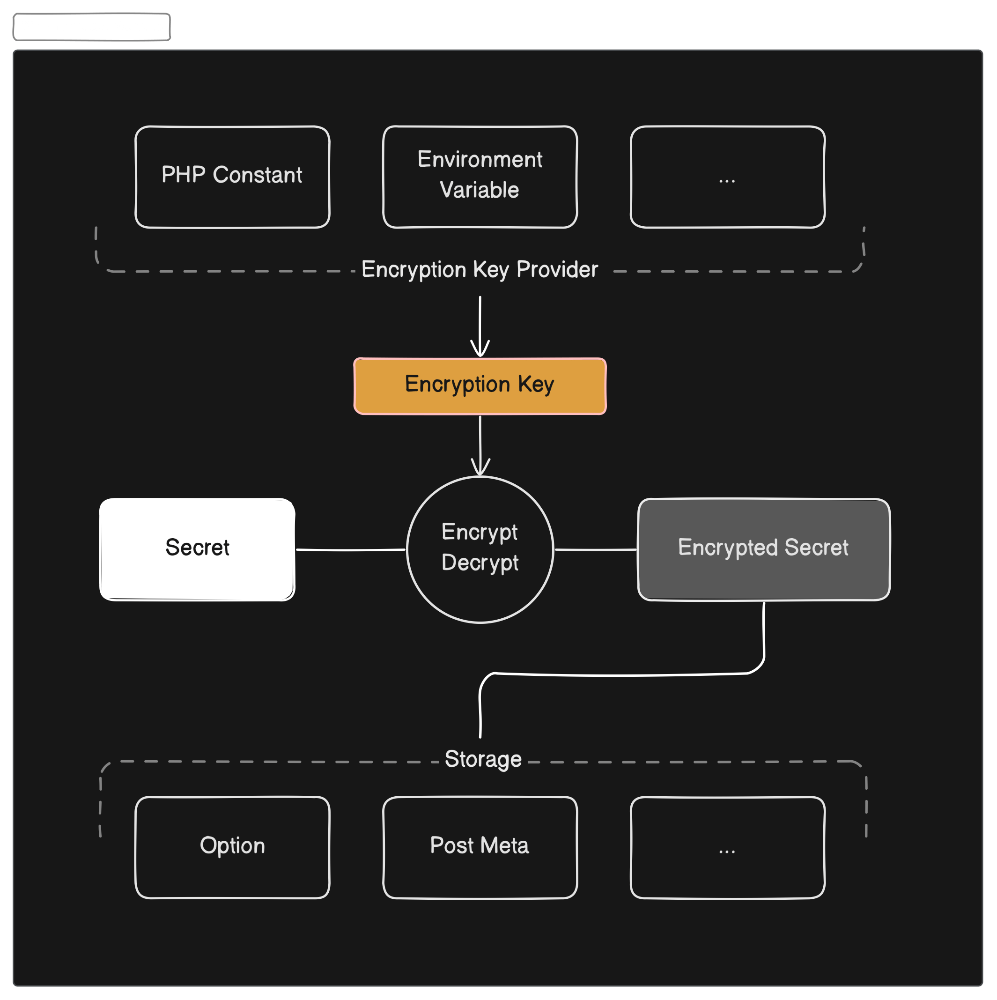

# Encrypted Secrets for WordPress

PHP package for storing and retrieving encrypted secrets in WordPress using symetrical encryption keys from constants, files or custom storage.



## Concepts

Encryption keys are retrieved from different storages that implement the [`Encryption_Key_Storage` interface](php/class-encryption-key-storage-interface.php) while the encryption methods implement the [`Encryption_Provider` interface](php/class-encryption-provider-interface.php).

## Available Implementations

### Encryption Secret Storage

The following methods for storing secrets are available:

#### Secrets in PHP constants and environment variables

Returns a secret from a constant or an environment variable as fallback:

```php
$secret_storage = new WPElevator\Encrypted_Secrets\Encryption_Key_Storage_Memory( 'MY_SECRET_CONSTANT' );
$secret_key = $secret_storage->get();

if ( $secret_key ) {
	// Do something.
}
```

#### Secrets in PHP files

Store secrets in PHP files:

```php
<?php return array (
  'key' => 'CgqSFJ3VJnZwj8UHNg3pwGUV4XeIVGSBqNzyxBUAZhI=',
  'created' => 1742299697,
);
```

using the following API:

```php
$secret_storage = new WPElevator\Encrypted_Secrets\Encryption_Key_Storage_PHP_File( '/path/to/secret.php' );
$encryption_key = $secret_storage->get_key();

if ( ! $encryption_key && $secret_storage->is_supported() ) {
	$secret_storage->set_key( '...' );
	$encryption_key = $secret_storage->get_key();
}

if ( $encryption_key ) {
	// Do something.
}
```

### Encryption MethodProviders

#### Sodium with `ParagonIE_Sodium_Compat` fallback

Note that WordPress core already includes [`ParagonIE_Sodium_Compat`](https://github.com/WordPress/WordPress/tree/b68a7b5200d65557f8c055c448875a0a821f9be0/wp-includes/sodium_compat) as a fallback for PHP installations that do not have the [`sodium` extension](https://www.php.net/manual/en/book.sodium.php) available.

```php
$secret_storage = new WPElevator\Encrypted_Secrets\Encryption_Key_Storage_PHP_File( '/path/to/secret.php' );
$encryption = new WPElevator\Encrypted_Secrets\Encryption_Provider_Sodium_Compat();

if ( $encryption->is_supported() ) {
	$encryption_key = $secret_storage->get_key();

	// Generate an encryption key, if not configured.
	if ( ! $encryption_key && $secret_storage->is_supported() ) {
		$secret_storage->set_key( $encryption->generate_key() );
		$encryption_key = $secret_storage->get_key();
	}

	if ( $secret_key ) {
		$encrypted = $encryption->encrypt( 'my secret', $encryption_key ); // Encrypt.
		$decrypted = $encryption->decrypt( $encrypted, $encryption_key ); // Decrypt.
	}
}
```

## Credits

Licensed under the [GNU General Public License v2.0 or later](https://spdx.org/licenses/GPL-2.0-or-later.html).
